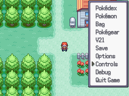

# Set the Controls Screen
This script is for Pokémon Essentials. It creates a "Set the controls" screen on pause menu, allowing the player to map the actions to the keys in keyboard and buttons in a gamepad, ignoring the values defined on F1. You can also define the default controls.

## Screens

## Compatibility
Doesn't work on Essentials versions 19.1 and older. To see other Essentials versions, look at [all branches](../../branches/all). Gamepad support doesn't works in MKXP-Z presents in Essentials versions 20.1 and older.

## Installation
Follow the [Script](/Script.rb) instructions.