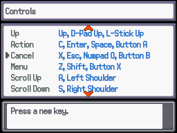

# Set the Controls Screen
This script is for Pokémon Essentials. It creates a "Set the controls" screen on pause menu, allowing the player to map the actions to the keys in keyboard, ignoring the values defined on F1. You can also define the default controls.

## Screens

## Compatibility
Doesn't work on Essentials versions older than v20. To see other Essentials versions, look at [all branches](../../branches/all).

## Installation
Follow the [Script](/Script.rb) instructions. The sample script files are in [Files folder](/Files).